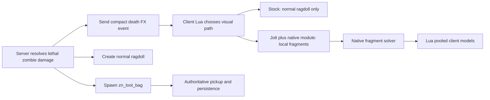

# Physics Theoretical Module Experiment

## Status

This is a design for an isolated research project, not an implementation request and not a commitment to modify Garry's Mod engine binaries. It complements [physics-upgrade.md](physics-upgrade.md): `zn_loot_bag`, death rules, XP, and pickup behavior remain normal Lua gameplay systems.

The experiment has one purpose: determine whether a small native C++ module can make local death debris and fragment motion look better at a bounded cost, while standard Source ragdolls automatically benefit when Jolt is installed. It must not make the game depend on Jolt or on the native module.

## Core Decision

Do not attempt to replace VPhysics from a ZombieSim module.

Volt already replaces the engine `IPhysics` implementation. It is installed as a game binary, selects CPU-specific binaries internally, and exposes `vjolt_*` console variables. A normal Garry's Mod C++ module is loaded through Lua and officially receives an `ILuaBase` bridge. That does not provide a supported, stable C++ pointer to the engine's live VPhysics environment or to `IPhysicsObject` instances.

The experiment therefore has two deliberately separate layers:

1. Standard Garry's Mod ragdolls use the currently installed engine physics. If the process is running Volt, those ragdolls use Jolt automatically.
2. An optional client native module simulates a small pool of decorative fragments. It never changes damage, collision, loot, XP, entity ownership, or map travel.

This avoids building a second physics engine that cannot reliably collide with Source world geometry, and it avoids treating a fragile engine hook as normal gamemode code.



## Non-Negotiable Boundaries

- `zn_loot_bag` owns loot. Ragdolls and fragments never contain inventory.
- The server decides damage, rewards, drop tables, and all persistent state.
- Native fragments are client-local visual objects. A client can disable or lose them without changing gameplay.
- The module does not replace `vphysics.dll`, load another engine DLL, patch memory, hook simulation, or retain raw engine/entity pointers.
- The first experiment uses no worker thread that touches Lua or engine state.
- The first experiment uses no generic skeletal fracture system. It supports one pre-authored zombie visual profile at most.
- No module binary is placed in the gamemode or Workshop payload. Garry's Mod only discovers modules installed directly under `garrysmod/lua/bin`.

## What "Jolt Installed" Means

Jolt is process-wide, not per-player gameplay capability. A server running Jolt and a client running Jolt are separate engine processes. ZombieSim must not assume a mixed server/client installation is supported until it is tested on the exact Garry's Mod branch and Volt build.

The gamemode can use the following conservative signals:

```lua
local hasLocalJolt = GetConVar("vjolt_substeps") ~= nil
local hasNativeFragmentModule = type(rawget(_G, "ZM_PhysicsNative")) == "table"
```

These signals only choose a local visual tier. They do not alter a networked entity, force, hit result, or reward.

| Server state | Client state | Result |
| --- | --- | --- |
| Stock VPhysics | Any client | Standard ragdoll and loot bag. |
| Jolt test server | Matching Jolt client, no native module | Jolt-driven normal ragdoll; no extra fragments. |
| Jolt test server | Matching Jolt client plus native module | Jolt-driven normal ragdoll plus local enhanced fragments. |
| Any server | No Jolt or no native module | Standard visual fallback. |
| Unknown mixed Jolt installation | Any | Not a supported configuration until the smoke suite passes. |

The server may advertise a visual ceiling through a simple net message, but each client decides only whether it can render the optional local enhancement. The server never waits for a client capability report.

## Module Shape

Start client-only. Do not create a server module until a measurement proves that a server-native helper solves a real problem.

| Artifact | First experiment | Responsibility |
| --- | --- | --- |
| `gmcl_zombiesimphysics_win64.dll` | Yes | Fixed-step local fragment simulation, deterministic seed handling, bounded state pool, diagnostics. |
| `gmsv_zombiesimphysics_win64.dll` | No | Deferred. It would be useful only for a proven server-side calculation or telemetry gap. |
| Volt binaries | Operator-installed separately | Replace the process VPhysics backend; never distributed by ZombieSim. |

For Linux x64, the equivalent client and server files use the `gmcl_` or `gmsv_` prefix and `_linux64.dll` suffix even though the file content is an ELF shared object. Exact artifacts must match the active Garry's Mod branch and architecture.

## External Project Layout

Keep the native project outside this gamemode repository. It has a different build toolchain, release cadence, and failure mode.

```text
zombiesim-physics-module/
  CMakeLists.txt
  CMakePresets.json
  third_party/
    gmod-module-base/              # pinned Facepunch development revision
  src/
    common/
      fixed_math.hpp
      fragment_pool.hpp
      fragment_pool.cpp
      fragment_solver.hpp
      fragment_solver.cpp
      lua_stack_guard.hpp
      module_version.hpp
    client/
      module_client.cpp
      lua_api_client.cpp
    server/
      module_server.cpp             # not built in experiment one
  tests/
    fragment_solver_tests.cpp
  scripts/
    install-local-win64.ps1
    uninstall-local-win64.ps1
  docs/
    compatibility-matrix.md
    release-checklist.md
  dist/
```

Pin `gmod-module-base` from the branch referenced by Facepunch's current CMake guide. Record its exact commit in the module repository, rather than relying on a moving branch during compatibility testing.

## Build and Installation Plan

### Windows x64

1. Use Visual Studio 2022 with Desktop Development with C++ and CMake.
2. Clone the module project and its pinned `gmod-module-base` dependency.
3. Configure an x64 CMake build with C++20 for the module's internal code. Inherit the GMod ABI settings from `gmod-module-base`; do not invent a runtime-library configuration independently.
4. Build a `RelWithDebInfo` artifact first, then a stripped Release artifact only after the smoke tests pass.
5. Produce `gmcl_zombiesimphysics_win64.dll`.
6. Copy it manually to `<GarrysMod>/garrysmod/lua/bin/` in a disposable install. Do not copy it into `gamemodes/zombiesim`.
7. Restart Garry's Mod completely before testing. Do not rely on hot unload/reload for a native DLL.

Suggested commands after the external project exists:

```powershell
cmake -S . -B build/win64 -A x64 -DCMAKE_BUILD_TYPE=RelWithDebInfo
cmake --build build/win64 --config RelWithDebInfo
ctest --test-dir build/win64 --output-on-failure
```

The CMake target must produce the exact realm/platform name expected by Garry's Mod. The official convention is `gmcl_<module>_win64.dll` for a Windows x64 client module and `gmsv_<module>_win64.dll` for a Windows x64 server module.

### Loading

Do not call `pcall(require, "zombiesimphysics")` from the gamemode. Garry's Mod can still print a missing-module error through `require`, which is unsuitable for a normally optional feature.

Instead, the optional module distribution contains a tiny manually installed client loader outside the gamemode:

```lua
-- garrysmod/lua/autorun/client/zombiesimphysics_loader.lua
require("zombiesimphysics")
```

The module creates `_G.ZM_PhysicsNative` during `GMOD_MODULE_OPEN`. The gamemode only reads that global:

```lua
local native = rawget(_G, "ZM_PhysicsNative")
if type(native) == "table" and native.ApiVersion == 1 then
    -- Optional native visual path is available.
end
```

This makes absence safe: no loader means no native table and ordinary Lua rendering continues.

## Native ABI Contract

The module uses the published Garry's Mod module base and only its documented Lua bridge:

```cpp
#include <GarrysMod/Lua/Interface.h>

using namespace GarrysMod::Lua;

GMOD_MODULE_OPEN()
{
    // Create _G.ZM_PhysicsNative and register C functions.
    return 0;
}

GMOD_MODULE_CLOSE()
{
    // Destroy all module-owned state. Do not call Lua from worker threads.
    return 0;
}
```

`GMOD_MODULE_OPEN` and `GMOD_MODULE_CLOSE` export the `gmod13_open` and `gmod13_close` entrypoints. `ILuaBase` provides the stack API used to validate arguments, create the API table, and return primitive values.

### API Rules

- Every public call validates argument count, Lua type, finite numeric values, and allowed ranges.
- Every public call either returns a normal result or `false, "reason"`; malformed developer calls can use `ArgError` during early testing.
- Native functions use numeric ids and plain Lua numbers. They do not accept or retain `Entity`, `PhysObj`, `Vector`, `Angle`, or arbitrary userdata pointers.
- No Lua stack item remains on the stack after a native function returns except its declared results. Add a `LuaStackGuard` in debug builds to assert this.
- Module state is owned by a single `FragmentWorld` object. `GMOD_MODULE_CLOSE` calls `Reset()` before releasing it.
- No C++ background thread calls `ILuaBase`, rendering functions, or engine interfaces. The initial solver runs on the main client thread in a fixed bounded budget.

## Lua API Surface

Expose a small table rather than dozens of globals:

```text
ZM_PhysicsNative.ApiVersion                  -> number
ZM_PhysicsNative.GetInfo()                   -> table
ZM_PhysicsNative.Configure(maxFragments, maxClusters, fixedHz) -> true | false, reason
ZM_PhysicsNative.Spawn(seed, px, py, pz, vx, vy, vz, count, lifetime, style) -> clusterId | false, reason
ZM_PhysicsNative.PrepareFrame(deltaSeconds, maxTraceRequests) -> traceRequests
ZM_PhysicsNative.ResolveTraces(traceResults) -> resolvedCount
ZM_PhysicsNative.ReadRenderState()           -> fragmentTransforms
ZM_PhysicsNative.Destroy(clusterId)          -> true | false
ZM_PhysicsNative.Reset()                     -> true
ZM_PhysicsNative.GetStats()                  -> table
ZM_PhysicsNative.RunSelfTest()               -> true | false, reason
```

### Input Limits

The module clamps values before entering the solver:

| Value | Initial limit |
| --- | ---: |
| Active fragments | 24 |
| Active clusters | 4 |
| Spawned fragments per death | 6 |
| Lifetime | 0.25 to 3 seconds |
| Fixed steps per rendered frame | 3 |
| Fixed simulation rate | 60 Hz |
| World collision traces per frame | 8 |
| Initial speed | 0 to 1,200 Source units/second |
| Initial angular speed | 0 to 720 degrees/second |

These are intentionally small. Volt may simulate more objects efficiently, but Source rendering, Lua crossings, and map collision queries still have their own limits. Increase one limit only after the benchmark and soak tests show headroom.

## Fragment Solver Design

### State

Use a fixed-capacity structure-of-arrays or a fixed `std::array` pool. There must be no allocation in `PrepareFrame`, `ResolveTraces`, or `ReadRenderState` after `Configure` succeeds.

Each fragment stores:

```text
active                 bool
clusterId              uint16
fragmentId             uint16
position               float x, y, z
velocity               float x, y, z
rotation               float pitch, yaw, roll
angularVelocity        float pitch, yaw, roll
radius                 float
restitution            float
linearDrag             float
age                    float
lifetime               float
bounceCount            uint8
pendingTrace           bool
style                  uint8
seed                   uint32
```

Do not simulate fragment-to-fragment collisions, skeleton constraints, joints, penetration damage, or interaction with players. The fragments are decorative shards/limbs, not a second physical world.

### Fixed Step

`PrepareFrame(deltaSeconds, maxTraceRequests)`:

1. Clamp the supplied delta to 0.05 seconds and add it to an accumulator.
2. Run at most three 1/60-second fixed steps.
3. For every active fragment, apply gravity, drag, velocity, rotation, age, and distance culling.
4. Build at most `maxTraceRequests` swept-sphere requests for the nearest and fastest fragments. Other fragments continue with ballistic motion for that step.
5. Return only simple trace jobs: numeric fragment id, start coordinates, end coordinates, and radius.

Lua performs a world-only `util.TraceHull` for each returned job. It then builds compact numeric results containing fragment id, hit flag, fraction, hit coordinates, and surface normal. `ResolveTraces(traceResults)` does the following:

1. Rejects unknown ids and invalid values.
2. Moves an unblocked fragment to its predicted endpoint.
3. Places a hit fragment at the impact point plus a tiny normal offset.
4. Reflects the velocity around the normal, multiplies it by restitution, reduces angular velocity, and increments its bounce count.
5. Sleeps/removes a fragment after enough bounces, low speed, or lifetime expiry.

`ReadRenderState()` returns transforms only for active fragments. Client Lua applies those transforms to a fixed pool of `ClientsideModel` instances. The module does not call the renderer, create entities, or own engine render resources in the first experiment.

### Why This Hybrid Exists

A C++ module can safely own numerical state through `ILuaBase`, but the official module base does not provide a supported engine trace or render interface. Batching a small number of Lua `TraceHull` calls gives the fragments believable floor and wall collisions without scanning symbols or borrowing private engine pointers.

The design is useful only if measurement proves that native fixed-step bookkeeping is cheaper and more stable than a pure Lua equivalent. If the Lua bridge dominates the cost, stop the experiment rather than widening it into engine detours.

## Rendering Bridge

Client Lua owns a pool of precreated, non-networked `ClientsideModel` instances. It never creates one model per frame.

```text
On death event:
  select a supported visual profile
  if local Jolt and native module are available:
      native.Spawn(...)
  else:
      use normal ragdoll and optional stock particle/decal fallback

On client Think:
  trace native.PrepareFrame() jobs
  native.ResolveTraces(results)
  apply native.ReadRenderState() transforms to pooled models

On map change, Lua reload, or mode disable:
  native.Reset()
  hide/release all pooled client models
```

The first visual profile should have only two or three fragment model choices. A future model-profile table can map a known zombie model to permitted fragment models and a bodygroup hide action. Unsupported models must emit only an ordinary ragdoll.

## Server and Client Integration

### Lua Files To Add Only After the Module ABI Smoke Test

```text
gamemode/
  sh_physics_profile.lua       # server mode and local feature selection helpers
  sv_death_effects.lua         # authoritative ragdoll, bag spawn, cleanup, death event
  cl_death_effects.lua         # normal fallback plus optional native fragment bridge
entities/entities/
  zn_loot_bag/
    shared.lua
    init.lua
    cl_init.lua
```

The native module is not included by `init.lua` or `cl_init.lua`. It is discovered only through `_G.ZM_PhysicsNative` after the operator-installed loader has loaded it.

### Server Profile Resolution

```lua
local requested = GetConVar("zombiesim_physics_mode"):GetString()
local hasServerJolt = GetConVar("vjolt_substeps") ~= nil

if requested == "jolt" and hasServerJolt then
    return "jolt"
end
return "stock"
```

This is an operator guard, not a guarantee of Volt version compatibility. It is enough for the gamemode to avoid assuming Jolt when it is absent. The experimental installation matrix remains the authority for deciding whether a Jolt server is allowed to host players.

### Compact Death Event

Lua owns networking. The C++ module does not read or write Garry's Mod net messages.

The server sends one versioned event to nearby clients after it creates the normal ragdoll and `zn_loot_bag`:

```text
version             uint4
sequence            uint16
sourceEntity        entity
visualProfile       uint8
origin              vector
impulse             vector, server-clamped
seed                uint32
```

No inventory, health, damage result, bone transform, or client-selected dismemberment result is sent. The event only says that an already-authoritative death has a local optional visual enhancement.

### One Supported Dismemberment Profile

The first Jolt-enhanced profile should be explicit and narrow:

```text
profile id:     zombie_basic_01
condition:      server has resolved a lethal bullet or blast hit on an allowed hit group
ragdoll:        normal Source ragdoll
optional FX:    one or two client-local fragment models
max lifetime:   3 seconds
fallback:       standard ragdoll with no extra fragment models
```

Do not alter the actual ragdoll skeleton, call unknown ragdoll internals, or try to detach arbitrary bones. The body remains a normal ragdoll. The local fragments provide the visual impression while remaining removable at any time.

## C++ Implementation Sequence

### Phase 0: Empty ABI Module

- Create the external CMake project using `gmod-module-base`.
- Build only `gmcl_zombiesimphysics_win64.dll`.
- Register `_G.ZM_PhysicsNative` with `ApiVersion = 1`, `GetInfo`, and `RunSelfTest`.
- `GetInfo` returns fixed build metadata and `features = { fragmentSolver = false }`.
- Install in a disposable Garry's Mod client and verify it loads once after a full game restart.

Exit condition: module loads, API table exists, no Lua stack imbalance, no crash on client shutdown.

### Phase 1: Deterministic In-Memory Solver

- Add `FragmentWorld` without game integration.
- `RunSelfTest` simulates a fixed seed for 120 ticks and checks a known state hash.
- Add C++ unit tests for pool exhaustion, invalid values, expiry, bounce response, and reset.
- Turn on `features.fragmentSolver = true` only when every test passes.

Exit condition: the solver is deterministic, bounded, and free of per-frame allocations in a profiler build.

### Phase 2: Lua Trace and Model Pool Test

- Add a client-only developer command that creates one test cluster at the local player's aim point.
- Add the Lua world-trace adapter and a pool of at most 24 client models.
- Verify fragments settle against floors/walls, disappear on time, and vanish on map change.
- Test with native module absent: the command must choose the stock fallback without errors.

Exit condition: 100 repeated test clusters create no persistent client models, no engine errors, and no error spam.

### Phase 3: One Zombie Death Path

- Add `zn_loot_bag` first and validate pickup independently.
- Attach the visual death event to one controlled zombie death path.
- Always create the ordinary server ragdoll. Enable extra local fragments only on clients that have both the native table and `vjolt_substeps`.
- Keep the initial cap at six fragments per death and 24 active fragments total.

Exit condition: bags remain lootable after all visual objects expire, map transitions succeed, and stock clients see no gameplay difference.

### Phase 4: Jolt Comparison

Use a disposable matching Jolt server/client installation only:

1. Run the same ten-zombie death sequence under stock VPhysics.
2. Run it under Jolt with native fragments disabled.
3. Run it under Jolt with native fragments enabled.
4. Compare bag drops, XP, map transitions, console errors, active fragment counts, and client frame times.
5. Keep the enhanced path only if it is visibly better and stable. Otherwise retain Jolt ragdolls alone and remove the module integration.

## Diagnostics and Measurements

Expose only diagnostic data that the Lua bridge can safely report:

```text
GetStats() -> {
  activeFragments = number,
  activeClusters = number,
  pendingTraceRequests = number,
  spawned = number,
  expired = number,
  droppedByBudget = number,
  fixedSteps = number,
  simulationMicroseconds = number,
  apiErrors = number
}
```

Add a developer-only Lua command that prints this table after a test burst. Do not add a production HUD, server file writer, or general telemetry service before the experiment demonstrates value.

Initial acceptance targets:

- No change to loot bag creation, collection, XP, or death authority between stock and enhanced paths.
- Zero leaked client models after `Reset`, map change, or gamemode reload.
- No native crash or Lua error in 1,000 local fragment spawns.
- At 24 active fragments, native simulation p95 stays below 0.25 ms on the target development machine, excluding Lua traces and rendering.
- At eight trace requests per frame, client frame-time regression is not visually noticeable in the test map.

These are experimental gates, not promises. If the native bridge or Lua tracing is slower than a straightforward Lua implementation, stop.

## Failure Handling

| Failure | Required behavior |
| --- | --- |
| Module absent | No load attempt by the gamemode; stock visuals continue. |
| `ApiVersion` mismatch | Ignore the module and log one local warning. |
| Jolt convar absent | Do not spawn enhanced fragments. |
| Pool full | Reject the new cluster; do not evict gameplay entities. |
| Invalid trace result | Drop only that fragment. |
| Lua error in visual bridge | Disable native fragments for the current map; ordinary ragdolls remain. |
| Map change or game shutdown | Call `Reset`, hide all pooled models, and permit process restart. |
| Jolt smoke test failure | Set server mode to `stock` and stop the Jolt experiment. |

There is no automatic binary rollback. Installing or replacing Volt happens only while Garry's Mod is stopped, under operator control, with a known-good backup of the original files.

## Explicitly Rejected Approaches

### Linking Jolt Into the Module

Rejected for the first experiment. A second Jolt instance inside a client module would not automatically share Volt's Source collision world, ragdolls, or broadphase. Extracting map collision and syncing another engine would be more complex than the feature and would still not control the process VPhysics implementation.

### Direct VPhysics Object Access

Rejected. `ILuaBase` can recognize a `PhysObj` userdata type, but the official module base does not promise a C++ `IPhysicsObject` pointer or stable engine ABI. Casting userdata or reading engine memory is not an acceptable foundation for gameplay.

### Detouring or Signature Scanning

Deferred to a separate, disposable research branch and not required for this experiment. Facepunch documents module detouring techniques, but they depend on per-build signatures, engine binary layouts, and carefully removing hooks at shutdown. Do not hook `IPhysicsEnvironment::Simulate`, collision callbacks, ragdoll internals, or entity creation in ZombieSim's normal distribution.

A later read-only timing experiment is only acceptable when all of the following are true:

- It runs only in a disposable local installation.
- It has an exact game build fingerprint and refuses unknown builds.
- It has no write, override, or gameplay behavior.
- It is removed completely before any normal server release.

### C++ Ownership of Networking or Persistence

Rejected. Lua already owns net messages, player/profile persistence, and world data. A module that duplicates those ownership boundaries makes rollback and inspection harder without improving the physics experiment.

## Future Server Module Criteria

Do not build `gmsv_zombiesimphysics` unless one measured need remains after the client experiment. Valid reasons could include a CPU-heavy deterministic fragment seed planner or an engine-safe, read-only backend telemetry API. It must still satisfy these rules:

- Its absence chooses stock Lua behavior.
- It exposes a versioned, narrow Lua table only.
- It does not inspect private entity memory, replace a VPhysics interface, or patch an engine binary.
- It never owns loot, combat, XP, net messages, or database writes.

## Research References

- Facepunch CMake binary module guide: https://wiki.facepunch.com/gmod/Creating_Binary_Modules:_CMake
- Facepunch C Lua bridge guide: https://wiki.facepunch.com/gmod/C_Lua:_Functions
- Facepunch module base headers: https://github.com/Facepunch/gmod-module-base
- Facepunch `require` behavior and module location: https://wiki.facepunch.com/gmod/Global.require
- Facepunch PhysObj API and collision caveats: https://wiki.facepunch.com/gmod/PhysObj
- Volt source and release notes: https://github.com/misyltoad/VPhysics-Jolt

## Ready-To-Start Checklist

The experiment is ready to begin only when these are true:

- A disposable x64 Garry's Mod install exists, separate from the working development install.
- Volt installation and removal have been tested manually with the game fully stopped.
- A pinned `gmod-module-base` revision and Visual Studio/CMake build can produce a trivial client DLL.
- The first test will be Phase 0 only: load `ZM_PhysicsNative`, return version data, and shut down cleanly.
- `zn_loot_bag` and the regular Lua ragdoll path remain separate tasks and are not blocked by the module experiment.
